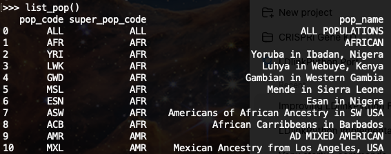
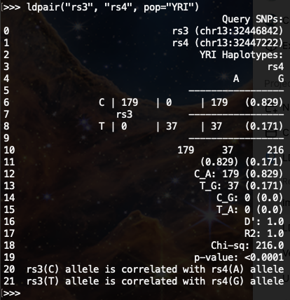

## ldlinkpy
Project Status: Work in Progress (WIP) - 
This project is currently a work in progress.  Feedback and contributions are welcome.

### Calculating Linkage Disequilibrium in Human Populations of Interest

<p align="center">
  <a href="LICENSE"></a>
  <a href="https://python.org"></a>
</p>

## Introduction

LDlink is an interactive and powerful suite of web-based tools for querying germline variants in human population groups of interest to generate interactive tables and plots. All population genotype data originates from Phase 3 (Version 5) of the 1000 Genomes Project and variant RS numbers are indexed based on dbSNP 155.

`ldlinkpy` is Python library developed to query and download results (internet access required) generated by LDlink web-based applications. `ldlinkpy` accelerates genomic research by providing efficient and user-friendly functions to programmatically interrogate pairwise linkage disequilibrium from large lists of genetic variants.

Please see the online LDlink documentation for more information about understanding linkage disequilibrium (LD) and additional details about how LDlink calculates patterns of LD across a variety of ancestral human populations.

## Install

`ldlinkpy` is currently installed from GitHub (not PyPI yet).
Using a virtual environment is also the standard recommendation.

### Requirements
- Python 3.10 or newer
- Git

### macOS

```bash
# Optional, remove old virtual environment
rm -rf .venv
# Create new virtual environment
python3 -m venv .venv
./.venv/bin/python -m pip install --upgrade pip
./.venv/bin/python -m pip install "git+https://github.com/timyers/ldlinkpy.git"
```

### Windows (Powershell)
```powershell
py -m venv .venv
.\.venv\Scripts\python -m pip install --upgrade pip
.\.venv\Scripts\python -m pip install "git+https://github.com/timyers/ldlinkpy.git"
```

## Quick Start

### 1. Personal Access Token - **Required**

In order to access the [LDlink](https://ldlink.nih.gov) API via `ldlinkpy`, we use a personal access token.

You will need to:

- Make a one-time request for your personal access token from a web browser at <https://ldlink.nih.gov/apiaccess>.
- Once registered, your personal access token will be emailed to you.  It is a string of 12 random letters and numbers. 
- `ldlinkpy` uses your personal LDlink API token for access.  By default it reads your token from the LDLINK_TOKEN environment variable.  Set it as an environment variable named `LDLINK_TOKEN`.  See examples below:

#### macOS / Linux

```bash
export LDLINK_TOKEN="your_token_here"
```

#### Windows (Powershell)
```powershell
$env:LDLINK_TOKEN="your_token_here"
```

### 2. Start Python

#### macOS / Linux
```bash
./.venv/bin/python
```

#### Windows 
```powershell
.\.venv\Scripts\python
```

### 3. Import `ldlinkpy`

```python
from ldlinkpy import list_pop, list_chips, ldpair, ldproxy
```

### 4. Try a simple lookup

List available 1000 Genomes populations:
```python
list_pop()
```

<p align="center">
  
</p>

List available genotyping SNP chips:
```python
list_chips()
```
### 5. Run a simple analysis

Check LD between two variants:

```python
ldpair("rs3", "rs4", pop="YRI")
```

<p align="center">
  
</p>

Find proxy variants for a SNP:

```python
ldproxy("rs7412", pop="CEU")
```

### Notes

- `ldlinkpy` reads your token from the LDLINK_TOKEN environment variable by default.
- Most functions return pandas DataFrames.
- You can also pass `token="your_token_here"` directly to functions as an argument if you prefer not to use an environment variable.

## Longer usage examples to use from local repo root
### LDtrait notes

- **Recommended:** use `request_method="auto"` (POST). This is the default and is the most reliable.
- **Optional:** `request_method="get"` uses the `ldtraitget` endpoint. In some environments this may fail due to network/TLS issues. If you hit errors with GET, switch back to POST.

### `ldhap` command-line examples (1–4)

Set your token once in your shell:

```bash
export LDLINK_TOKEN="YOUR_TOKEN_HERE"
```

1) Haplotype table (default):

```bash
PYTHONPATH=. python -c "from ldlinkpy import ldhap; df=ldhap(snps=['rs3','rs4'], pop=['CEU','YRI'], table_type='haplotype', genome_build='grch37', token=None); print(df.head().to_string(index=False))"
```

2) Variant table:

```bash
PYTHONPATH=. python -c "from ldlinkpy import ldhap; df=ldhap(snps=['rs3','rs4'], pop='CEU', table_type='variant', genome_build='grch38', token=None); print(df.head().to_string(index=False))"
```

3) Both tables:

```bash
PYTHONPATH=. python -c "from ldlinkpy import ldhap; out=ldhap(snps=['rs3','rs4'], pop=['CEU','YRI'], table_type='both', genome_build='grch37', token=None); print('Variant table:'); print(out['variant'].head().to_string(index=False)); print(''); print('Haplotype table:'); print(out['haplotype'].head().to_string(index=False))"
```

4) Merged table:

```bash
PYTHONPATH=. python -c "from ldlinkpy import ldhap; df=ldhap(snps=['rs3','rs4'], pop=['CEU','YRI'], table_type='merged', genome_build='grch37', token=None); print(df.head().to_string(index=False))"
```

Notes:

- `snps` supports 1–30 variants (rsID or chromosome coordinate like `chr7:24966446`).
- `pop` accepts a string or a list of valid 1000G population codes.
- `genome_build` supports `grch37`, `grch38`, and `grch38_high_coverage`.
- `table_type` supports `haplotype`, `variant`, `both`, and `merged`.

### `snpclip` command-line examples (1–8)

Set your token once in your shell:

```bash
export LDLINK_TOKEN="YOUR_TOKEN_HERE"
```

1) Basic default call (CEU, default thresholds):

```bash
PYTHONPATH=. python -c "from ldlinkpy import snpclip; df=snpclip(snps=['rs3','rs4'], token=None); print(df.head().to_string(index=False))"
```

2) Multiple populations:

```bash
PYTHONPATH=. python -c "from ldlinkpy import snpclip; df=snpclip(snps=['rs3','rs4','rs148890987'], pop=['CEU','YRI','CHB'], token=None); print(df.head(10).to_string(index=False))"
```

3) Custom thresholds:

```bash
PYTHONPATH=. python -c "from ldlinkpy import snpclip; df=snpclip(snps=['rs3','rs4'], r2_threshold=0.2, maf_threshold=0.05, token=None); print(df.to_string(index=False))"
```

4) GRCh38 build:

```bash
PYTHONPATH=. python -c "from ldlinkpy import snpclip; df=snpclip(snps=['rs3','rs4'], genome_build='grch38', token=None); print(df.head().to_string(index=False))"
```

5) GRCh38 high coverage + explicit token argument:

```bash
PYTHONPATH=. python -c "from ldlinkpy import snpclip; df=snpclip(snps=['rs3','rs4'], genome_build='grch38_high_coverage', token='YOUR_TOKEN_HERE'); print(df.head().to_string(index=False))"
```

6) Save output to a TSV file:

```bash
mkdir -p tmp
PYTHONPATH=. python -c "from ldlinkpy import snpclip; df=snpclip(snps=['rs3','rs4'], pop='CEU', token=None, file='tmp/snpclip_rs3_rs4.tsv'); print('saved', len(df), 'rows')"
```

7) Raw mode (no DataFrame parsing):

```bash
PYTHONPATH=. python -c "from ldlinkpy import snpclip; out=snpclip(snps=['rs3','rs4'], token=None, return_type='raw'); print(type(out)); print(str(out)[:500])"
```

8) Coordinate-style variant input:

```bash
PYTHONPATH=. python -c "from ldlinkpy import snpclip; df=snpclip(snps=['chr7:24966446','chr7:24966584'], pop='CEU', token=None); print(df.head().to_string(index=False))"
```

### `ldpop` command-line examples (1–4)

Set your token once in your shell:

```bash
export LDLINK_TOKEN="YOUR_TOKEN_HERE"
```

1) Quick test (defaults: `pop='CEU'`, `r2d='r2'`, `genome_build='grch37'`):

```bash
PYTHONPATH=. python -c "from ldlinkpy import ldpop; df=ldpop(var1='rs3', var2='rs4', token=None); print(df.to_string(index=False))"
```

2) Multiple populations + D-prime output:

```bash
PYTHONPATH=. python -c "from ldlinkpy import ldpop; df=ldpop(var1='rs3', var2='rs4', pop=['CEU','YRI','CHB'], r2d='d', token=None); print(df.to_string(index=False))"
```

3) Coordinate input + GRCh38 (using a variant present in 1000G):

```bash
PYTHONPATH=. python -c "from ldlinkpy import ldpop; df=ldpop(var1='chr13:31872705', var2='rs4', pop='CEU', r2d='r2', genome_build='grch38', token=None); print(df.to_string(index=False))"
```

4) Save output to a TSV file:

```bash
PYTHONPATH=. python -c "from ldlinkpy import ldpop; ldpop(var1='rs3', var2='rs4', pop='CEU', token=None, file='tmp/ldpop_rs3_rs4.tsv'); print('saved tmp/ldpop_rs3_rs4.tsv')"
```

### `SNPchip` command-line examples (1–8)

Used to find commercial genotyping chip arrays for variants. Input is a list of between 1 - 5000 variants (one per line) and desired commercial chip arrays to search. Input variants do not need to be on the same chromosome.

**Arguments**

- `snps` (required): one rsID or chromosome coordinate string, or a list of those values; valid formats include `rs3` and `chr7:24966446`; supports 1–5000 variants.
- `chip` (optional, default: `"ALL"`): one platform code or a list of platform codes; special values: `ALL`, `ALL_Illumina`, `ALL_Affy`.
- `genome_build` (optional, default: `"grch37"`): one of `grch37`, `grch38`, `grch38_high_coverage`.
- `token` (optional): LDlink token string. If omitted (`None`), `LDLINK_TOKEN` environment variable is used.
- `api_root` (optional): custom LDlink API root URL (default is package `DEFAULT_API_ROOT`).
- `return_type` (optional, default: `"dataframe"`): `"dataframe"` for parsed output or `"raw"` for raw response text.

Output is a data frame of query variant rows (RS number), genomic coordinate (GRCh37) and genotyping chip array columns. The presence of a `1` designates the variant is present on the respective commercial genotyping array and a `0` indicates that it is not present on the genotyping array.

Set your token once in your shell:

```bash
export LDLINK_TOKEN="YOUR_TOKEN_HERE"
```
1) Basic call (defaults: `chip='ALL'`, `genome_build='grch37'`):
   
```bash
PYTHONPATH=. python -c "from ldlinkpy import snpchip; df=snpchip(['rs3','rs4']); print(df)"
```

2) Mixed rsID and coordinate query:

```bash
PYTHONPATH=. python -c "from ldlinkpy import snpchip; df=snpchip(['chr7:24966446','rs148890987']); print(df)"
```

3) Affymetrix-only search (`ALL_Affy`):

```bash
PYTHONPATH=. python -c "from ldlinkpy import snpchip; df=snpchip(['rs3','rs4'], chip='ALL_Illumina', genome_build='grch38'); print(df)"
```
5) Explicit platform list:

```bash
python -c "from ldlinkpy import snpchip; df=snpchip(['rs3','rs4'], chip=['A_SNP5.0','A_SNP6.0','I_1M']); print(df)"
```

6) Raw response output:

```bash
PYTHONPATH=. python -c "from ldlinkpy import snpchip; out=snpchip(['rs3','rs4'], return_type='raw'); print(type(out)); print(str(out)[:500])"
```

7) Explicit token argument (using `rs4`):

```bash
PYTHONPATH=. python -c "from ldlinkpy import snpchip; df=snpchip(['rs4'], token='YOUR_TOKEN_HERE'); print(df)"
```

8) Save DataFrame to TSV:

```bash
PYTHONPATH=. python -c "from ldlinkpy import snpchip; df=snpchip(['rs3','rs4']); df.to_csv('tmp/snpchip_output.tsv', sep='\t', index=False); print('wrote tmp/snpchip_output.tsv')"
```

### `list_chip_platforms` / `list_chips` command-line examples

Provides a data frame listing the names and abbreviation codes for available commercial SNP Chip Arrays from Illumina and Affymetrix.
These lookup helpers are local, packaged-data utilities (no network calls).

1) Show first 10 chip mappings via `list_chip_platforms`:

```bash
PYTHONPATH=. python -c "from ldlinkpy import list_chip_platforms; df=list_chip_platforms(); print(df.head(10).to_string(index=False))"
```

2) Show chip mappings via `list_chips`:

```bash
PYTHONPATH=. python -c "from ldlinkpy import list_chips; df=list_chips(); print(df)"
```

3) Confirm row count and column order:

```bash
PYTHONPATH=. python -c "from ldlinkpy import list_chip_platforms; df=list_chip_platforms(); print('rows=', len(df)); print('columns=', df.columns.tolist())"
```

4) Find one specific platform code (`I_GSA-v1`):

```bash
PYTHONPATH=. python -c "from ldlinkpy import list_chip_platforms; df=list_chip_platforms(); print(df.loc[df['chip_code']=='I_GSA-v1'].to_string(index=False))"
```

5) Verify the alias `list_chips` returns the same table:

```bash
PYTHONPATH=. python -c "from ldlinkpy import list_chip_platforms, list_chips; import pandas.testing as pdt; pdt.assert_frame_equal(list_chip_platforms(), list_chips()); print('list_chips alias matches list_chip_platforms')"
```

6) Export packaged lookup data to CSV:

```bash
PYTHONPATH=. python -c "from ldlinkpy import list_chips; df=list_chips(); df.to_csv('tmp/chip_platforms.csv', index=False); print('wrote tmp/chip_platforms.csv with', len(df), 'rows')"
```

7) Build a quick code->name dictionary and print selected entries:

```bash
PYTHONPATH=. python -c "from ldlinkpy import list_chips; df=list_chips(); d=dict(zip(df['chip_code'], df['chip_name'])); print('I_100 =>', d['I_100']); print('A_PMRA =>', d['A_PMRA']); print('A_UKBA =>', d['A_UKBA'])"
```

8) List only Affymetrix chip platforms:

```bash
PYTHONPATH=. python -c "from ldlinkpy import list_chips; df=list_chips(); print(df[df['chip_code'].str.startswith('A_')].to_string(index=False))"
```

### `list_pop` command-line examples

Provides a data frame listing the available reference populations from the 1000 Genomes Project, continental or super-populations (e.g. European, African, Admixed American) and sub-populations (e.g Finnish, Gambian, Peruvian)
These lookup helpers are local, packaged-data utilities (no network calls).

1) Show first 10 population mappings:

```bash
PYTHONPATH=. python -c "from ldlinkpy import list_pop; df=list_pop(); print(df.head(10).to_string(index=False))"
```

2) Confirm row count and column order:

```bash
PYTHONPATH=. python -c "from ldlinkpy import list_pop; df=list_pop(); print('rows=', len(df)); print('columns=', df.columns.tolist())"
```

3) Find one specific population code (`YRI`):

```bash
PYTHONPATH=. python -c "from ldlinkpy import list_pop; df=list_pop(); print(df.loc[df['pop_code']=='YRI'].to_string(index=False))"
```

4) Build a quick pop_code -> (super_pop_code, pop_name) mapping and print selected entries:

```bash
PYTHONPATH=. python -c "from ldlinkpy import list_pop; df=list_pop(); d={r.pop_code:(r.super_pop_code, r.pop_name) for r in df.itertuples(index=False)}; print('ALL =>', d['ALL']); print('YRI =>', d['YRI']); print('CEU =>', d['CEU'])"
```

5) List only EAS sub-populations:

```bash
PYTHONPATH=. python -c "from ldlinkpy import list_pop; df=list_pop(); print(df[df['super_pop_code']=='EAS'].to_string(index=False))"
```

6) Export packaged population lookup data to CSV:

```bash
PYTHONPATH=. python -c "from ldlinkpy import list_pop; df=list_pop(); df.to_csv('tmp/populations.csv', index=False); print('wrote tmp/populations.csv with', len(df), 'rows')"
```

### `list_gtex_tissues` command-line examples

Provides a data frame listing the GTEx full names, LDexpress full names (without spaces) and acceptable abbreviation codes of the 54 non-diseased tissue sites collected for the GTEx Portal and used as input for the LDexpress.
These lookup helpers are local, packaged-data utilities (no network calls).

1) Show first 10 GTEx tissue mappings:

```bash
PYTHONPATH=. python -c "from ldlinkpy import list_gtex_tissues; df=list_gtex_tissues(); print(df.head(10).to_string(index=False))"
```

2) Confirm row count and column order:

```bash
PYTHONPATH=. python -c "from ldlinkpy import list_gtex_tissues; df=list_gtex_tissues(); print('rows=', len(df)); print('columns=', df.columns.tolist())"
```

3) Find one specific tissue code (`Whole Blood`):

```bash
PYTHONPATH=. python -c "from ldlinkpy import list_gtex_tissues; df=list_gtex_tissues(); print(df.loc[df['tissue_name_gtex']=='Whole Blood'].to_string(index=False))"
```

4) Build a quick GTEx -> (LDexpress name, abbreviation) mapping and print selected entries:

```bash
PYTHONPATH=. python -c "from ldlinkpy import list_gtex_tissues; df=list_gtex_tissues(); d={r.tissue_name_gtex:(r.tissue_name_ldexpress, r.tissue_abbrev_ldexpress) for r in df.itertuples(index=False)}; print('Whole Blood =>', d['Whole Blood']); print('Adipose - Visceral (Omentum) =>', d['Adipose - Visceral (Omentum)']); print('Select All Tissues =>', d['Select All Tissues'])"
```

5) List only tissues with names starting with `Brain -`:

```bash
PYTHONPATH=. python -c "from ldlinkpy import list_gtex_tissues; df=list_gtex_tissues(); print(df[df['tissue_name_gtex'].str.startswith('Brain -')].to_string(index=False))"
```

6) Export packaged GTEx lookup data to CSV:

```bash
PYTHONPATH=. python -c "from ldlinkpy import list_gtex_tissues; df=list_gtex_tissues(); df.to_csv('tmp/gtex_tissues.csv', index=False); print('wrote tmp/gtex_tissues.csv with', len(df), 'rows')"
```
