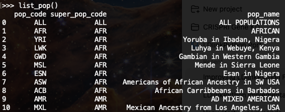
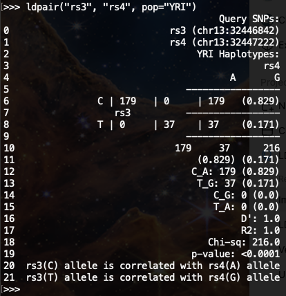

## LDlinkPy

### A Python interface to LDlink for reproducible linkage disequilibrium workflows

Project status: First public release series. Feedback and issue reports are welcome.

<p align="center">
  <a href="https://pypi.org/project/ldlinkpy/"></a>
  <a href="LICENSE.txt"></a>
  <a href="https://python.org"></a>
</p>

## Introduction

[LDlink](https://ldlink.nih.gov/) is an interactive suite of web-based tools for investigating linkage disequilibrium (LD) across ancestral population groups. `LDlink` uses publicly available 1000 Genomes Project reference haplotypes to calculate population-specific LD, accepts variants as RefSNP (RS) numbers or genomic positions, and references dbSNP for RS identifiers and bi-allelic variant information. Depending on the module, `LDlink` also incorporates data from resources such as UCSC RefSeq, RegulomeDB, genetic maps, the GTEx Portal, the GWAS Catalog, and FORGEdb.

Internet access and a personal LDlink API token are required for API calls.

## Install

`LDlinkPy` is available from PyPI. Using a virtual environment is recommended.

### Requirements

- Python 3.10 or newer

### macOS / Linux

```bash
python3 -m venv .venv
./.venv/bin/python -m pip install --upgrade pip
./.venv/bin/python -m pip install ldlinkpy
```

### Windows PowerShell

```powershell
py -m venv .venv
.\.venv\Scripts\python -m pip install --upgrade pip
.\.venv\Scripts\python -m pip install ldlinkpy
```

## Quick Start

### 1. Get And Set Your LDlink Token

Request a personal access token at <https://ldlink.nih.gov/apiaccess>. Once registered, your token will be emailed to you.

`LDlinkPy` reads your token from the `LDLINK_TOKEN` environment variable by default. You can also pass `token="your_token_here"` directly to endpoint functions.

macOS / Linux:

```bash
export LDLINK_TOKEN="your_token_here"
```

Windows PowerShell:

```powershell
$env:LDLINK_TOKEN="your_token_here"
```

### 2. Start Python

macOS / Linux:

```bash
./.venv/bin/python
```

Windows PowerShell:

```powershell
.\.venv\Scripts\python
```

### 3. Import LDlinkPy

```python
from ldlinkpy import list_pop, list_chips, ldpair, ldproxy
```

### 4. Try A Simple Lookup

List available 1000 Genomes populations:

```python
list_pop()
```

<p align="center">
  
</p>

List available genotyping SNP chips:

```python
list_chips()
```

### 5. Run A Simple Analysis

Check LD between two variants:

```python
ldpair("rs3", "rs4", pop="YRI")
```

<p align="center">
  
</p>

Find proxy variants for a SNP:

```python
ldproxy("rs7412", pop="CEU")
```

## Public Functions

| Function | Purpose |
| --- | --- |
| `ldpair` | Query LD statistics for one or more variant pairs. |
| `ldmatrix` | Create an LD matrix for a set of variants. |
| `ldproxy` | Find proxy variants for a query variant. |
| `ldproxy_batch` | Run multiple LDproxy queries and write result files. |
| `ldtrait` | Query trait associations linked to variants in LD. |
| `ldexpress` | Query GTEx expression associations for variants in LD. |
| `ldhap` | Query haplotype and variant tables for a variant set. |
| `ldpop` | Query LD statistics across populations for two variants. |
| `snpclip` | Prune variants by LD and minor allele frequency thresholds. |
| `snpchip` | Identify genotyping arrays containing variants. |
| `list_pop` | Return available 1000 Genomes population codes. |
| `list_chips` / `list_chip_platforms` | Return available genotyping chip/platform codes. |
| `list_gtex_tissues` | Return GTEx tissue names and LDexpress tissue codes. |

Most endpoint functions return pandas DataFrames by default. Some functions support raw responses, file output, or endpoint-specific return shapes. See the API reference for details.

## More Documentation

- [API reference](docs/api_reference.md): public functions, parameters, return types, and common exceptions.
- [Longer usage examples](docs/examples.md): endpoint-by-endpoint command-line examples for local development and exploratory testing.
- [End-to-end examples](examples/README.md): includes an LDlinkPy-only workflow examining population-specific LD, haplotype structure, and optional SNPchip coverage for published SNP tags at the Ewing sarcoma 6p25.1/RREB1 susceptibility locus.

## Authorship

`LDlinkPy` was conceived and overseen by Timothy Myers, Stephen Chanock, and Mitchel Machiela, with code and documentation assistance from ChatGPT 5.2 Thinking (OpenAI) and Codex 5.5 High (OpenAI). Additional authors and contributors may be added as the project develops.

## AI Assistance Disclosure

`LDlinkPy` was developed with assistance from AI coding tools and agents, including ChatGPT 5.2 Thinking (OpenAI) and Codex 5.5 High (OpenAI). AI tools assisted with code generation, implementation, and documentation. Package behavior is validated by comparing outputs against the [LDlink](https://ldlink.nih.gov/) web app and the [`LDlinkR`](https://github.com/CBIIT/LDlinkR/tree/master) R package. Human contributors conceived the project, directed development, defined validation criteria, ran validation checks, and made release decisions.

## Relationship To LDlinkR

`LDlinkPy` is intended to provide Python access to the major [LDlink](https://ldlink.nih.gov/) workflows familiar to [`LDlinkR`](https://github.com/CBIIT/LDlinkR/tree/master) users. Function names and behavior are generally aligned where practical, while using Python conventions such as pandas DataFrames and keyword arguments.

## Development Status

This package is in its first public release series. Feedback from biomedical research users is welcome, especially on endpoint behavior, documentation clarity, and example workflows.
