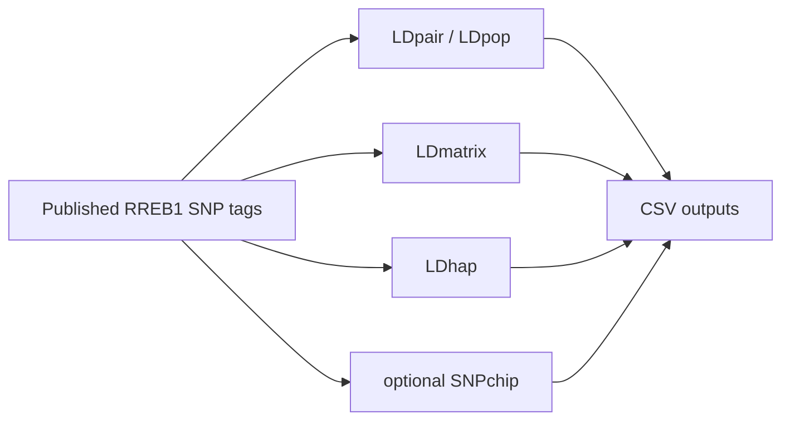

# RREB1 haplotype feasibility example, GRCh37

This example is an end-to-end, LDlinkPy-only workflow for evaluating published SNP tags at the Ewing sarcoma 6p25.1/RREB1 susceptibility locus.

The practical question is whether LDlinkPy can evaluate if the published 3-SNP RREB1 haplotype tag is usable for standard SNP-based analyses across 1000 Genomes populations. The script runs sequential LDlinkPy calls for pairwise LD, population LD summaries, ancestry-specific LD matrices, haplotype frequencies, and SNPchip coverage.

This example uses `genome_build="grch37"` because the RREB1 paper reports the 6p25.1 microsatellite region and locus context using hg19/GRCh37 coordinates.

## Run The Example

Set your LDlink API token:

```bash
export LDLINK_TOKEN="your-token-here"
```

From the repository root:

```bash
python examples/rreb1_haplotype_feasibility_grch37.py
```

To preview the planned calls without a token:

```bash
python examples/rreb1_haplotype_feasibility_grch37.py --dry-run
```

By default, outputs are written to:

```text
examples/output/rreb1_haplotype_feasibility_grch37
```

## Two-Step Workflow

Step 1 creates the LDlinkPy source CSV files:

```bash
python examples/rreb1_haplotype_feasibility_grch37.py
```

Step 2 summarizes those local CSV files into clean summary tables, a Mermaid workflow diagram, and a Markdown report:

```bash
python examples/rreb1_summarize_haplotype_feasibility.py
```

Optional simple PNG plots can be requested with:

```bash
python examples/rreb1_summarize_haplotype_feasibility.py --make-plots
```

The second script reads local CSV files only. It does not call LDlink, does not require `LDLINK_TOKEN`, and does not use external annotations.

The script writes CSV source files for:

- `LDpair` results for key published SNP pairs in EUR
- `LDpop` results for the same SNP pairs across ALL 1000 Genomes populations
- `LDmatrix` results for `rs7742053`, `rs17142617`, `rs74781311`, and `rs2876045` in EUR, AFR, AMR, EAS, and SAS
- `LDhap` results for the 3-SNP haplotype markers `rs17142617`, `rs74781311`, and `rs2876045` in EUR, AFR, AMR, EAS, and SAS
- `SNPchip` coverage for the 4-SNP set
- `rreb1_variant_metadata.csv`
- `manifest.json`



## Biological Note

This example does not directly measure GGAA microsatellite length. It evaluates LD, haplotype structure, and SNPchip coverage for published SNP tags at the 6p25.1/RREB1 locus.

The RREB1 paper's biological result depends on targeted long-read sequencing of the GGAA microsatellite. LDlinkPy evaluates SNP linkage disequilibrium, haplotype structure, and related LDlink outputs, so this workflow should not be interpreted as reproducing the long-read microsatellite analysis.

## Possible Downstream Figures And Tables

The CSV outputs could later be used to create:

- an LDlinkPy workflow diagram
- ancestry-specific LD matrices or heatmaps for the RREB1 4-SNP set
- haplotype frequency summaries across EUR, AFR, AMR, EAS, and SAS
- tables comparing pairwise LD among published RREB1 SNP tags
- a practical SNP-based feasibility table with optional chip coverage

## Scope And Limitations

This first example intentionally stays narrow:

- It does not use external annotations.
- It does not query RegulomeDB, GTEx, ENCODE, LDexpress, LDtrait, or GWAS Catalog.
- It does not reproduce long-read sequencing.
- It does not infer GGAA microsatellite length directly.
